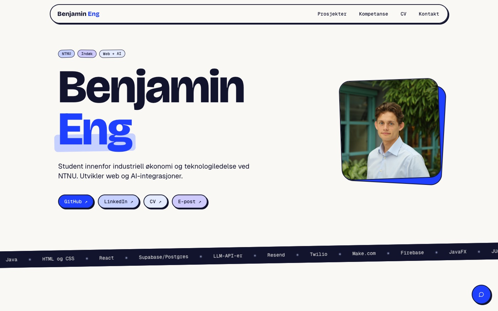

# portfolio

Porteføljesiden min, med prosjekter, kompetanse, CV og en AI-assistent som svarer på spørsmål om meg.

**Live:** [benjamin-eng.vercel.app](https://benjamin-eng.vercel.app/)



## Teknologi

| | |
|---|---|
| Frontend | React 18, TypeScript, Vite |
| Styling | Tailwind CSS, egne designvariabler i `src/index.css` |
| Skjema | react-hook-form og zod |
| Serverfunksjoner | Vercel Functions i `api/` |
| AI-assistent | Claude Sonnet 5.5 via Anthropic SDK |
| E-post | Resend |

## Struktur

```
src/
├── content/        Alt innhold: prosjekter, ferdigheter, CV og profil
├── components/     React-komponentene som viser innholdet
├── assets/         Profilbilde og skjermbilder av prosjektene
└── lib/            Hjelpefunksjoner (fargepalett, bildeoppslag)
api/
├── chat.ts         AI-assistenten
├── contact.ts      Kontaktskjemaet
├── _knowledge.ts   Bygger systemprompten fra src/content
└── _rateLimit.ts   Enkel grense for antall forespørsler
```

Innhold og visning er skilt: for å legge til et prosjekt endrer man bare `src/content/projects.ts`. Kortet, ferdighetene i Kompetanse og AI-assistentens kunnskap oppdateres automatisk.

## Slik fungerer AI-assistenten

1. Chatten i nettleseren sender samtalen til `/api/chat`.
2. `api/_knowledge.ts` bygger en systemprompt av de samme datafilene som siden bruker: prosjekter, CV og ferdigheter. Assistenten vet dermed bare det som står på siden.
3. Serverfunksjonen sender systemprompten og de siste meldingene til Claude og returnerer svaret.
4. Systemprompten ber assistenten svare kort, bare ut fra faktaene, uten å vurdere ferdighetsnivå, og henvise til e-post når den ikke vet svaret.

API-nøkkelen finnes bare på serveren. Hver IP-adresse kan stille 20 spørsmål per ti minutter, og meldingene er begrenset til 1000 tegn.

## Kjør lokalt

Krever Node.js 20 eller nyere.

```bash
npm install
cp .env.example .env.local   # fyll inn nøklene
npm run dev
```

Siden kjører på http://localhost:8080. En liten Vite-utvidelse i `vite.config.ts` kjører funksjonene i `api/` lokalt, slik Vercel gjør i produksjon.

### Miljøvariabler

| Variabel | Brukes til |
|---|---|
| `ANTHROPIC_API_KEY` | AI-assistenten |
| `RESEND_API_KEY` | Kontaktskjemaet |
| `CONTACT_FROM` | Avsenderadresse på et domene som er verifisert i Resend |
| `CONTACT_TO` | Hvor meldingene fra skjemaet sendes |

På Vercel legges de samme variablene inn under Settings → Environment Variables.
